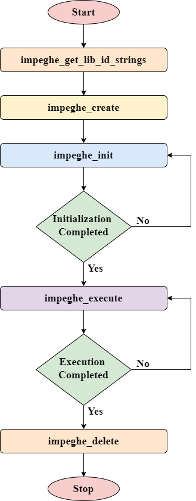

# Introduction of the MPEG-H 3D Audio Low Complexity Profile Encoder


The advent of object-based audio and scene-based audio has revolutionized the 
3D sound experience. 
Traditional channel-based coding expects the capture and playback geometric 
locations to be exactly the same for best reconstruction of the audio scene. 
On the other hand, object-based audio coding represents discrete sound sources 
in the audio scene. The positional information of each of the objects in the 
audio scene is conveyed in the form of metadata. 
Scene-based audio coding attempts to reconstruct the sound field at the playback
end using the coded higher order ambisonics (HOA) information. In case of both 
object-based and scene-based audio, the rendering algorithm can adapt based on 
the configuration of the playback end loudspeaker arrangement, thus making the 
sound experience agnostic to the configuration of speakers at the playback end.

MPEG-H 3D Audio is a coding standard that supports traditional channel-based, 
object-based and scene-based audio coding. 
The immersive 3D sound experience created by MPEG-H 3D Audio is significantly enhanced in
comparison with the traditional channel-based multichannel programs and playback
systems.

The MPEG-H 3D Audio Low Complexity Profile encoder supports all specified formats, 
including channel-based audio, object-based audio and scene-based audio via higher 
order ambisonics (HOA). State-of-the-art MPEG-H 3D Audio Low Complexity Profile encoders according 
to [ISO/IEC 23008-3:2019/AMD 2:2020](https://www.iso.org/standard/79147.html) also support the MPEG-H 3D Audio Baseline Profile, which is a 
subset of the MPEG-H 3D Audio Low Complexity Profile. The MPEG-H 3D Audio Baseline 
Profile does not support scene-based audio/HOA.

The initial version supports sampling frequencies of 14.7kHz, 16kHz, 22.05kHz, 24kHz, 29.4kHz, 32kHz, 44.1kHz and 48kHz and requires a minimal bit-rate of 32kbps per channel. Further fine-tuning will be available in later version.

# Introduction to MPEG-H 3D Audio Low Complexity Profile Encoder APIs

## Files to be included are

* [`impeghe_type_def.h`](encoder/impeghe_type_def.h)
* [`impeghe_api.h`](encoder/impeghe_api.h)
* [`impeghe_error_standards.h`](encoder/impeghe_error_standards.h)
* [`impeghe_error_handler.h`](encoder/impeghe_error_handler.h)
* [`impeghe_apicmd_standards.h`](encoder/impeghe_apicmd_standards.h)
* [`impeghe_block_switch_const.h`](encoder/impeghe_block_switch_const.h)
* [`impeghe_drc_common.h`](encoder/impeghe_drc_common.h)
* [`impeghe_drc_uni_drc.h`](encoder/impeghe_drc_uni_drc.h)
* [`impeghe_drc_api.h`](encoder/impeghe_drc_api.h)
* [`impeghe_dmx_cicp2geometry.h`](encoder/impeghe_dmx_cicp2geometry.h)
* [`impeghe_dmx_matrix_common.h`](encoder/impeghe_dmx_matrix_common.h)
* [`impeghe_memory_standards.h`](encoder/impeghe_memory_standards.h)
* [`impeghe_drc_user_config.h`](test/impeghe_drc_user_config.h)
* [`impeghe_error_codes.h`](encoder/impeghe_error_codes.h)
* [`impeghe_mp4_writer.h`](test/impeghe_mp4_writer.h)
* [`impeghe_mae_config_defines.h`](test/impeghe_mae_config_defines.h)
* [`impeghe_bitbuffer.h`](encoder/impeghe_bitbuffer.h)
* [`impeghe_drc_tables.h`](encoder/impeghe_drc_tables.h)
* [`impeghe_drc_uni_drc_eq.h`](encoder/impeghe_drc_uni_drc_eq.h)
* [`impeghe_drc_uni_drc_filter_bank.h`](encoder/impeghe_drc_uni_drc_filter_bank.h)
* [`impeghe_drc_gain_enc.h`](encoder/impeghe_drc_gain_enc.h)
* [`impeghe_drc_struct_def.h`](encoder/impeghe_drc_struct_def.h)
* [`impeghe_drc_enc.h`](encoder/impeghe_drc_enc.h)

## Encoder APIs

| **API Call** | **Description** |
|------|------|
|impeghe_get_lib_id_strings | Gets the encoder library name and version number details |
|impeghe_create | Sets the encoder configuration parameters, gets the memory requirements and allocate required memory |
|impeghe_init | Initializes the encoder as per set configurations |
|impeghe_execute | Encodes the input frame data |
|impeghe_delete | Frees the allocated memories for the encoder |

## Flowchart of calling sequence



#  Building the MPEG-H 3D Audio Low Complexity Profile Encoder

## Building for Unix/MacOS
* Makefiles for building the MPEG-H 3D Audio Low Complexity Profile encoder library and application are provided in `build/makefile` folder.
* These makefiles are common for Unix/MacOS builds.
* If compiling for non-native platforms, ensure that the compiler and sysroot are updated.   
* Supported `arch` values are `x86`, `x86_64`, `armv7` and `armv8`.
* Build the library followed by the application using the below commands:
```
$ make -f Makefile_lib clean all ARCH=<arch>
$ make -f Makefile clean all	ARCH=<arch>
```

## Building for Windows
* MSVS projects files required for building the MPEG-H 3D Audio Low Complexity Profile encoder library and application are provided in `build/msvs` folder.
* These MSVS project files correspond to "MSVS 2017". If the MSVS version is different, then the SDK and toolset will have to be updated accordingly.

## Using CMake
Users can also use cmake to build for `x86`, `x86_64`, `armv7`, `armv8` and Windows (MSVS project) platforms.
The binaries get generated in libmpeghe/build/bin folder.

### Building for native platforms
Run the following commands to build the MPEG-H 3D Audio Low Complexity Profile Encoder for native platform:
```
Go to the root directory(libmpeghe/) of the MPEG-H 3D Audio Low Complexity Profile Encoder.
Create a new folder in the project root directory and move to the newly created folder.

$ cd <path to libmpeghe>
$ mkdir cmake_build
$ cd cmake_build
$ cmake ..
$ make
```

### Cross-compiling
Run the following commands to cross compile for `x86`, `ARMv7` or `ARMv8`:
```
Go to the root directory(libmpeghe/) of the MPEG-H 3D Audio Low Complexity Profile Encoder.
Create a new folder in the project root directory and move to the newly created folder.

$ cd <path to libmpeghe>
$ mkdir cmake_build
$ cd cmake_build
$ cmake .. -DCMAKE_TOOLCHAIN_FILE=../toolchain_<arch>.cmake
$ make
```

### Creating MSVS project files
To create MSVS project files for the MPEG-H 3D Audio Low Complexity Profile encoder from cmake, run the following commands:
```
Go to the root directory(libmpeghe/) of the MPEG-H 3D Audio Low Complexity Profile Encoder.
Create a new folder in the project root directory and move to the newly created folder.

$ cd <path to libmpeghe>
$ mkdir cmake_build
$ cd cmake_build
$ cmake -G "Visual Studio 15 2017" ..
```

The above command creates MSVS 2017 project files. If the version is different, modify the generator name accordingly.
The MPEG-H 3D Audio Low Complexity Profile encoder can be built using these project files.

# Running the MPEG-H 3D Audio Low Complexity Profile Encoder

The MPEG-H 3D Audio Low Complexity Profile Encoder can be run by providing command-line parameters(CLI options) directly or by providing a parameter file as a command line argument.
The MPEG-H 3D Audio Low Complexity Profile Encoder supports Channel-based, Object-based and HOA-based inputs. Channel based input are wave files which consist of set of monophonic channel signals represented as single wave file. Object based input comprises of metadata and a set of monophonic signals and each signal is in the form of monophonic wav file. The audio data can include object signals alone or both channel signals and object signals. HOA based input is provided as set of monophonic channel data where each channel signal is represented as mono wave file of 32-bit float with a sampling rate of 48kHz. HOA content of the format ACN/SN3D is supported.


Command line usage : 
```
<executable> -ifile:<inputfile> -ofile:<outputfile> [options]

[options] can be,
[-br:<bitrate>]
[-op_fmt:<output_format>]
[-cicp:<cicp_layout_index>]
[-oam_file:<oam_file>]
[-hoa_file:<first_hoa_file_name>]

where,
  <inputfile> is the input wav file name
  <outputfile> is the output MP4/MHAS file name
  <bitrate> is the bit-rate in bits per second.
        Range: 32000 to (6 * Sample rate * Number of channels)
        Default value is
        32000 for mono,
        64000 for stereo,
        192000 for 6-channel,
        256000 for 8-channel,
        320000 for 10-channel.
  <output_format> is the output format. (Supported values: 1 - MHAS, 2 - MHA1, 3 - MHM1).
        Default is 1 (MHAS).
  <cicp_layout_index> is the channel configuration index. Range: 1 to 20 except 8
        Description in format Front/Surr.LFE
        1: 1/0.0    - C
        2: 2/0.0    - L, R
        3: 3/0.0    - C, L, R
        4: 3/1.0    - C, L, R, Cs
        5: 3/2.0    - C, L, R, Ls, Rs
        6: 3/2.1    - C, L, R, Ls, Rs, LFE
        7: 5/2.1    - C, Lc, Rc, L, R, Ls, Rs, LFE
        8: NA
        9: 2/1.0    - L, R, Cs
        10: 2/2.0   - L, R, Ls, Rs
        11: 3/3.1   - C, L, R, Ls, Rs, Cs, LFE
        12: 3/4.1   - C, L, R, Ls, Rs, Lsr, Rsr, LFE
        13: 11/11.2 - C, Lc, Rc, L, R, Lss, Rss, Lsr, Rsr, Cs, LFE, LFE2, Cv, Lv, Rv, Lvss, Rvss, 
                      Ts, Lvr, Rvr, Cvr, Cb, Lb, Rb
        14: 5/2.1   - C, L, R, Ls, Rs, LFE, Lv, Rv
        15: 5/5.2   - C, L, R, Lss, Rss, Ls, Rs, Lv, Rv, Cvr, LFE, LFE2
        16: 5/4.1   - C, L, R, Ls, Rs, LFE, Lv, Rv, Lvs, Rvs
        17: 6/5.1   - C, L, R, Ls, Rs, LFE, Lv, Rv, Cv, Lvs, Rvs, Ts
        18: 6/7.1   - C, L, R, Ls, Rs, Lbs, Rbs, LFE, Lv, Rv, Cv, Lvs, Rvs, Ts
        19: 5/6.1   - C, L, R, Lss, Rss, Lsr, Rsr, LFE, Lv, Rv, Lvr, Rvr
        20: 7/6.1   - C, Leos, Reos, L, R, Lss, Rss, Lsr, Rsr, LFE, Lv, Rv, Lvs, Rvs
        If the parameter is not set or set to 0, default value is assigned based on number of input channels.
  <oam_file> file containing object metadata.
  <first_hoa_file_name> first hoa file name that ends with 00+.wav
```					 
					 
Sample CLI for Channel-based input: 
```
<impeghe_testbench.exe> -ifile:inp.wav -ofile:out.mhas -br:64000 -op_fmt:1
```


Sample CLI for Object-based input: 

Channel files should be named in the format item_name_A<azimuth_angle>_E<elevation_angle>.wav and be placed in same folder as .oam file.

Example: item_name_A+030_E+00.wav


Object files shoule be named as “<item_name>_<object_idx>.wav” and be placed in same folder as .oam file. The <object_idx> is a three-digit number counted from zero (padded from the left with zeros if needed).

Example: item_name_000.wav

The object metadata file (item_name.oam) is used to provide description of metadata for combined scene consisting of channels and objects or objects. The file-format needs to be maintained as per description in section 3.2 of [w13412 (3D_EncoderInputFormat).docx](https://mpeg.chiariglione.org/standards/mpeg-h/3d-audio/encoder-input-format-mpeg-h-3d-audio)


```
<impeghe_testbench.exe> -oam_file:<path_to_oam_file>/item_name.oam -ofile:output.mhas -op_fmt:1 -br:192000 -cicp:6
```


Sample CLI for HOA-based input: 

The naming convention of each channel signal need to adhere to Section 4.1 of [w13412 (3D_EncoderInputFormat).docx](https://mpeg.chiariglione.org/standards/mpeg-h/3d-audio/encoder-input-format-mpeg-h-3d-audio)
```
<impeghe_testbench.exe> -hoa_file:hoa_input_<order>_00+.wav -ofile:output.mhas -op_fmt:1 -br:128000 -cicp:6
```


**Using paramfile :**

The same CLI options can be provided to the MPEG-H 3D Audio Low Complexity Profile encoder via a parameter file.

Parameter file can be used to run multiple files in a single encoder instance.

Default parameter file name: `paramfilesimple.txt` 

Apart from the facility to invoke command line options, there are certain special options available that can be set in the parameter file. 

Below is the list of all such parameters:

```
@Input_path  <Path to Input WAVs location>
@Output_path <Path to write output MHAS/MP4s location>
@Oam_path <Path to be appended to oam file and all corresponding object and channel files>
@Hoa_path <Path to be appended to all hoa wav files>
@Start
<CLI options>
@Stop
```

Any CLI can be invoked only after `@Start`.

`@Stop` indicates end of CLI option processing.

Any CLI mentioned after `@Stop` will not be processed. 

In case there are multiple `@Start` and `@Stop`, the options between the `@Start` and `@Stop` will be processed.

A sample [`paramfilesimple.txt`](build/msvs/paramfilesimple.txt) can be found in `build/msvs` folder.

The Parameter file can be given as an argument to the application with the path specified.

The input and the output paths in parameter file should either be relative to the executable path or the absolute paths.

If no argument is given, by default the application reads the test vectors names from the parameter file located in the same directory as executable, with the name as paramfilesimple.txt.

Sample Usage:
```
<impeghe_testbench.exe> -paramfile:paramfilesimple.txt
```

For more details, refer to Section 2.1 of [`IA-MPEG-H-3D-Audio-LC-Enc-GSG.doc`](docs/IA-MPEG-H-3D-Audio-LC-Enc-GSG.doc)

# Building the Documentation of the MPEG-H 3D Audio Low Complexity Profile Encoder

Documentation can be generated with the doxygen utility for the MPEG-H 3D Audio Low Complexity Profile Encoder.
Follow the below commands to generate the documentation.

```
$ cd docs
$ doxygen doxy.conf
```

Documentation will be generated in `docs/documentation` folder.
Browse through the documentation from `index.html` located in `docs/documentation/html` folder.

# Additional Documents

Brief description about documents present in  `docs` folder

* [`IA-MPEG-H-3D-Audio-LC-Enc-API.doc`](docs/IA-MPEG-H-3D-Audio-LC-Enc-API.doc) - Describes Application Program Interface for the MPEG-H 3D Audio Low Complexity Profile Encoder.
* [`IA-MPEG-H-3D-Audio-LC-Enc-BP.doc`](docs/IA-MPEG-H-3D-Audio-LC-Enc-BP.doc) - Describes the build procedure for the MPEG-H 3D Audio Low Complexity Profile Encoder on Unix/MacOS platforms. 
* [`IA-MPEG-H-3D-Audio-LC-Enc-GSG.doc`](docs/IA-MPEG-H-3D-Audio-LC-Enc-GSG.doc) - Getting Started Guide for the MPEG-H 3D Audio Low Complexity Profile Encoder.

# FFMPEG Plugin Support

An intial version of a FFMPEG plugin is provided along with documentation for integrating the MPEG-H 3D Audio Low Complexity Profile Encoder library and plugin into FFMPEG framework.

For more details, refer to [`ITT_FFMPEG_MPEGH_ENC_UG.docx`](ffmpeg_plugin/ffmpeg/docs/ITT_FFMPEG_MPEGH_ENC_UG.docx)

### Guidelines working with GitHub

Please refer to the [guildelines](GUIDELINES.md) for the following processes
- Reporting issues
- Creating Pull Request
- Commit message standards